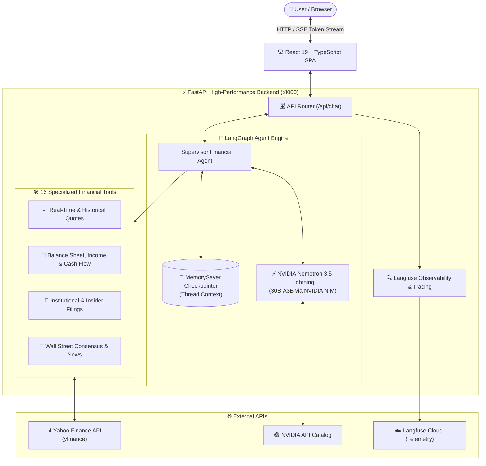

<div align="center">

# 📊 MarketPrism
### Enterprise Autonomous AI Financial Research & Stock Market Analysis

[](https://tinyurl.com/marketprism-ai)
[](https://opensource.org/licenses/MIT)
[](https://www.python.org/)
[](https://fastapi.tiangolo.com/)
[](https://www.langchain.com/)
[](https://react.dev/)
[](https://build.nvidia.com/)

<p align="center">
  <b>MarketPrism</b> is an institutional-grade, multi-agent stock market intelligence platform that delivers real-time equities pricing, fundamental balance sheets, institutional flows, and Wall Street analyst insights through an interactive, token-streamed conversational interface.
</p>

🔗 **Live Production URL:** [https://tinyurl.com/marketprism-ai](https://tinyurl.com/marketprism-ai)

</div>

---

## 📑 Table of Contents
- [System Architecture](#-system-architecture)
- [Technologies Used](#-technologies-used)
- [Key Features](#-key-features)
- [16-Tool Financial Analysis Suite](#-16-tool-financial-analysis-suite)
- [Project Directory Structure](#-project-directory-structure)
- [Local Installation & Setup](#-local-installation--setup)
  - [Prerequisites](#prerequisites)
  - [1. Clone Repository](#1-clone-repository)
  - [2. Configure Environment](#2-configure-environment)
  - [3. Set Up Python Backend](#3-set-up-python-backend)
  - [4. Launch Applications](#4-launch-applications)
- [API Reference](#-api-reference)
- [Sample Prompts to Test](#-sample-prompts-to-test)
- [Security & Best Practices](#-security--best-practices)
- [License](#-license)

---

## 🏗 System Architecture

MarketPrism executes an end-to-end agentic loop: natural language queries are parsed by an autonomous LangGraph supervisor, which delegates research tasks, dispatches real-time financial tools, and streams synthetic analyst insights back to the client over Server-Sent Events (SSE).



---

## 💻 Technologies Used

MarketPrism is built upon an enterprise-ready, strictly-typed technology stack:

### 1. Artificial Intelligence & Agent Orchestration
| Technology | Version / Spec | Role & Why It Was Chosen |
| :--- | :--- | :--- |
| **LangGraph** | `^1.0.5` | State-driven multi-agent orchestration. Manages conversation graphs, dynamic routing, cyclic agent execution, and state persistence via `MemorySaver`. |
| **LangChain Core** | `^1.1.3` | Schema definition for `SystemMessage`, `HumanMessage`, and structured `@tool` decorators. |
| **ChatOpenAI** | `langchain-openai` | Standard OpenAI-compatible abstraction connecting seamlessly to NVIDIA NIM endpoints. |
| **NVIDIA Nemotron 3.5 Lightning** | `30b-a3b` | 30-billion parameter language model optimized for rapid analytical reasoning, accurate JSON tool dispatching, and high token throughput. |
| **NVIDIA NIM** | API v1 | Enterprise inference microservice catalog (`integrate.api.nvidia.com`) providing low-latency model inference. |

### 2. Backend & API Services
| Technology | Version / Spec | Role & Why It Was Chosen |
| :--- | :--- | :--- |
| **Python** | `3.11+` | Core backend runtime selected for native compatibility with asynchronous AI frameworks and numerical libraries. |
| **FastAPI** | `^0.124` | Asynchronous ASGI web framework delivering microsecond endpoint routing, Pydantic validation, and native streaming responses. |
| **Uvicorn** | `^0.38` | Lightning-fast ASGI production web server implementing the HTTP/1.1 and WebSocket protocols. |
| **Pydantic v2** | `^2.12` | Strict data validation and schema definitions for incoming chat threads and nested message objects. |
| **Server-Sent Events (SSE)** | `text/event-stream` | Real-time chunked streaming protocol enabling token-by-token text generation directly to the frontend. |

### 3. Financial Data & Market Integrations
| Technology | Role & Why It Was Chosen |
| :--- | :--- |
| **yfinance** (`^0.2.66`) | Real-time and historical equity pricing, fundamental metrics, dividend histories, and corporate actions. |
| **Yahoo Finance Search API** | Direct ticker resolution endpoint with customized User-Agent headers to ensure zero-block lookups. |
| **Pandas / OpenPyXL** | In-memory tabular structuring and manipulation of balance sheet and cash flow datasets. |

### 4. MLOps, Tracing & Observability
| Technology | Role & Why It Was Chosen |
| :--- | :--- |
| **Langfuse** (`^3.10`) | End-to-end LLM application observability. Tracks nested trace spans, generation latency, token expenditure, and thread-level user telemetry. |

### 5. Frontend & UI Engineering
| Technology | Version / Spec | Role & Why It Was Chosen |
| :--- | :--- | :--- |
| **React** | `19.2.0` | Latest React runtime utilizing concurrent rendering features for smooth streaming animations without UI lockups. |
| **TypeScript** | `5.9.3` | Full type safety across component props, message state, and API payload definitions. |
| **Vite** | `7.2.4` | Next-generation frontend tooling and development server with instant Hot Module Replacement (HMR) and optimized Rollup production bundling. |
| **@crayonai/react-ui** | `^0.9.7` | Pre-built conversational AI UI elements (`C1Chat`, dark themes, suggestion pills). |
| **@thesysai/genui-sdk**| `^0.7.7` | Generative UI rendering components for structured financial cards and streaming text. |

### 6. DevOps & Containerization
| Technology | Role & Why It Was Chosen |
| :--- | :--- |
| **Docker** | Multi-stage containerization build compiling the React frontend in Node 20 and packaging static assets into a slim Python 3.11 runtime. |
| **GitHub Actions** | Automated CI/CD pipeline for testing, linting, building, and delivering updates to production on every push to `main`. |

---

## 🌟 Key Features

- **Autonomous Agent Reasoning:** Rather than guessing or hallucinating answers, the agent determines when live data is required and selects from 16 specialized analytical tools before synthesizing a response.
- **Real-Time Word-by-Word Streaming:** Utilizes Server-Sent Events (`text/event-stream`) to begin streaming tokens within milliseconds of request receipt.
- **Multi-Turn Contextual Memory:** Conversations persist across turns using session thread IDs (`threadId`), allowing follow-up questions like *"Compare their revenue to Ford"* after querying Tesla.
- **Smart Ticker Resolution:** Automatically resolves informal company names (e.g. *"Apple"*, *"Berkshire"*, *"Google"*) to their canonical market ticker symbols (`AAPL`, `BRK-B`, `GOOGL`).
- **Resilient Fallback Logging:** Automated runtime detection ensuring logs are written cleanly to memory or `/tmp/logs` across various deployment environments.

---

## 🛠 16-Tool Financial Analysis Suite

Every prompt is routed through the LangGraph engine with access to the following 16 tools:

```
                                  MarketPrism Toolset
                                          │
    ┌──────────────────┬──────────────────┼──────────────────┬──────────────────┐
    │                  │                  │                  │                  │
    ▼                  ▼                  ▼                  ▼                  ▼
[1. Quotes & Data] [2. Statements]    [3. Corporate]     [4. Ownership]     [5. Sentiment]
• get_stock_price  • get_balance_sheet • get_dividends   • get_major_       • get_analyst_
• get_historical_  • get_income_      • get_splits         shareholders       recommendations
    data               statement                         • get_institu-     • get_analyst_
• get_ticker       • get_cash_flow                         tional_holders     recommendations_
                   • get_company_info                    • get_mutual_        summary
                                                           fund_holders     • get_stock_news
                                                         • get_insider_
                                                           transactions
```

### Tool Catalog Reference

1. `get_stock_price(ticker)`: Fetches current market price, daily volume, high, low, and open.
2. `get_historical_data(ticker, period, interval)`: Pulls historical OHLCV pricing across flexible time horizons (1mo, 1y, 5y).
3. `get_ticker(company_name)`: Resolves natural language company names to standard exchange tickers.
4. `get_balance_sheet(ticker)`: Extracts assets, liabilities, working capital, and shareholder equity.
5. `get_income_statement(ticker)`: Delivers top-line revenue, operating margins, EBITDA, and net income.
6. `get_cash_flow(ticker)`: Evaluates free cash flow, operating cash, and capital expenditures (CapEx).
7. `get_company_info(ticker)`: Retrieves market capitalization, sector, forward P/E, beta, and summary.
8. `get_dividends(ticker)`: Analyzes dividend yield, annual payout rates, and historic distribution dates.
9. `get_splits(ticker)`: Audits historical stock split events and execution ratios.
10. `get_major_shareholders(ticker)`: Analyzes percentage breakdown of shares held by insiders vs. institutions.
11. `get_institutional_holders(ticker)`: Identifies leading institutional investors (e.g. Vanguard, BlackRock).
12. `get_mutual_fund_holders(ticker)`: Lists major mutual funds holding significant stakes.
13. `get_insider_transactions(ticker)`: Tracks recent C-suite buying and selling transactions filed with the SEC.
14. `get_analyst_recommendations(ticker)`: Gathers individual Wall Street firm ratings and price target updates.
15. `get_analyst_recommendations_summary(ticker)`: Summarizes consensus ratings across Strong Buy, Buy, Hold, and Sell.
16. `get_stock_news(ticker)`: Surfaces latest market headlines, press releases, and breaking stories.

---

## 📂 Project Directory Structure

```
MarketPrism/
├── MarketInsight/
│   ├── components/
│   │   ├── __init__.py
│   │   └── agent.py              # LangGraph agent, tool registration & NIM configuration
│   └── utils/
│       ├── __init__.py
│       ├── logger.py             # Logging infrastructure with /tmp fallback support
│       └── tools.py              # 16 financial tools interfacing with yfinance
├── config/
│   ├── __init__.py
│   └── config.py                 # Pydantic request models (RequestObject, Prompt)
├── frontend/                     # Modern React 19 single-page application
│   ├── public/                   # Static assets & icons
│   ├── src/
│   │   ├── assets/               # CSS & vector artwork
│   │   ├── App.css               # Dark theme & financial styling rules
│   │   ├── App.tsx               # Main chat interface with C1Chat integration
│   │   └── main.tsx              # React DOM initialization
│   ├── package.json              # Frontend dependencies
│   ├── tsconfig.json             # TypeScript configuration
│   └── vite.config.ts            # Vite proxy & build setup
├── main.py                       # FastAPI ASGI application & SSE streaming endpoints
├── requirements.txt              # Production Python package manifest
├── Dockerfile                    # Multi-stage containerization build file
├── docker-compose.yml            # Local Docker Compose service orchestrator
├── .env.example                  # Environment variable configuration template
├── .gitignore                    # Security and build exclusion rules
└── README.md                     # Comprehensive project documentation
```

---

## 🚀 Local Installation & Setup

Follow these steps to run MarketPrism on your local workstation.

### Prerequisites

Ensure the following tools are installed on your machine:
- **Python**: Version `3.11` or higher ([Download Python](https://www.python.org/downloads/))
- **Node.js**: Version `18` or higher with `npm` ([Download Node.js](https://nodejs.org/))
- **Git**: ([Download Git](https://git-scm.com/))
- **NVIDIA API Key**: Free inference API key from [build.nvidia.com](https://build.nvidia.com)

---

### 1. Clone Repository

```bash
git clone https://github.com/varshith0810/MarketPrism.git
cd MarketPrism
```

---

### 2. Configure Environment

Create your local `.env` configuration from the provided template:

```bash
cp .env.example .env
```

Open `.env` and supply your **NVIDIA API Key**:

```ini
# =====================================================================
# MarketPrism Configuration
# =====================================================================

# Required: NVIDIA NIM API Key (Obtain free at https://build.nvidia.com)
NVIDIA_API_KEY=nvapi-your-actual-api-key-here

# Optional: Model & Inference Settings
MODEL_NAME=nvidia/nemotron-3.5-lightning-30b-a3b
NVIDIA_BASE_URL=https://integrate.api.nvidia.com/v1
MODEL_TEMPERATURE=0.2

# Optional: Observability & Tracing (Langfuse)
LANGFUSE_PUBLIC_KEY=pk-lf-...
LANGFUSE_SECRET_KEY=sk-lf-...
LANGFUSE_HOST=https://cloud.langfuse.com
```

---

### 3. Set Up Python Backend

Create and activate a virtual environment to isolate project dependencies:

**On macOS / Linux:**
```bash
python3 -m venv venv
source venv/bin/activate
pip install -r requirements.txt
```

**On Windows (PowerShell):**
```powershell
python -m venv venv
.\venv\Scripts\Activate.ps1
pip install -r requirements.txt
```

---

### 4. Launch Applications

You can run MarketPrism locally in one of three ways:

#### Option A: Full Development Mode (Hot-Reloading)
*Recommended for active development and UI experimentation.*

1. **Terminal 1 — Start the FastAPI Backend:**
   ```bash
   # Ensure virtual environment is active
   python main.py
   ```
   *The backend starts at `http://localhost:8000`.*

2. **Terminal 2 — Start the React Vite Dev Server:**
   ```bash
   cd frontend
   npm install
   npm run dev
   ```
   *The frontend launches at `http://localhost:3000` (with built-in API proxy to `:8000`).*

3. **Open:** Navigate to **`http://localhost:3000`** in your browser.

---

#### Option B: Unified Production Mode (Single Port)
*Compiles the React application into static assets served directly by FastAPI.*

1. **Build the Frontend:**
   ```bash
   cd frontend
   npm install
   npm run build
   cd ..
   ```

2. **Run FastAPI:**
   ```bash
   python main.py
   ```

3. **Open:** Navigate to **`http://localhost:8000`** in your browser. Both the API and the user interface will be served together on port `8000`.

---

#### Option C: Local Docker Container
*Runs the entire application inside an isolated Docker container.*

1. **Build the image:**
   ```bash
   docker build -t marketprism:local .
   ```

2. **Run the container:**
   ```bash
   docker run -p 8000:8000 --env-file .env marketprism:local
   ```

3. **Open:** Navigate to **`http://localhost:8000`**.

---

## 📡 API Reference

### 1. Health Check
Checks backend health and service status.

- **URL:** `/health`
- **Method:** `GET`
- **Response:**
  ```json
  {
    "status": "ok",
    "message": "Service is running"
  }
  ```

---

### 2. Conversational Agent Streaming
Streams agent responses in real time using Server-Sent Events.

- **URL:** `/api/chat`
- **Method:** `POST`
- **Headers:** `Content-Type: application/json`
- **Request Body:**
  ```json
  {
    "threadId": "user-session-uuid-1234",
    "prompt": {
      "content": "What is NVIDIA's current stock price and operating cash flow?"
    }
  }
  ```
- **Response:** `Transfer-Encoding: chunked` stream (`text/event-stream`) returning word-by-word LLM generation chunks.

---

## 💡 Sample Prompts to Test

Once the application is running, try asking:

- 📊 **Valuation & Fundamentals:**
  > *"What is Apple's current stock price, P/E ratio, and gross profit margin for the last fiscal year?"*

- ⚖️ **Comparative Financial Analysis:**
  > *"Compare the revenue growth, debt-to-equity, and free cash flow of Microsoft versus Alphabet."*

- 🏦 **Institutional & Insider Tracking:**
  > *"Who are the top five institutional holders of Tesla, and have there been any insider sales by executives in the last 6 months?"*

- 🎯 **Wall Street Ratings:**
  > *"What is the consensus analyst rating and average price target for Amazon right now?"*

- 💵 **Dividends & Capital Allocation:**
  > *"Show me JPMorgan Chase's historical dividend payouts and dividend yield over the past 3 years."*

---

## 🔒 Security & Best Practices

- **Zero Hardcoded Secrets:** No API keys, credentials, or private tokens are stored in source code. All secrets are loaded exclusively via environment variables.
- **Strict Git Exclusions:** [`.gitignore`](.gitignore) is pre-configured to strictly ignore `.env`, `.env.*`, `*.pem`, `*.key`, and credential JSON files.
- **No Hallucination Policy:** The agent's system prompt strictly instructs it to verify data using tools before answering and explicitly prevents fabricating financial values.

---

## 📄 License

This project is licensed under the **MIT License** — see the [LICENSE](LICENSE) file for details.
